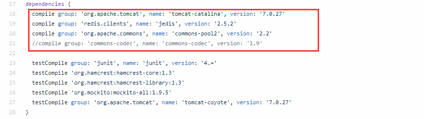
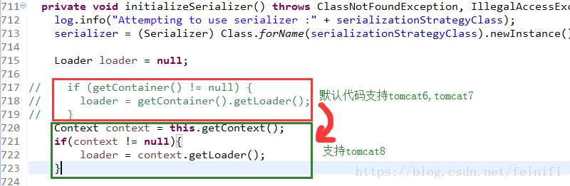

# SpringBoot实现Session共享的应用场景
## 问题引入
场景：nginx负载均衡后，出现的session不一致问题？例如客户端发起一个请求，这个请求到达 Nginx 上之后，
被Nginx转发到TomcatA上，然后在Tomcat A上往session中保存了一份数据，下次又来一个请求，这个请求被转发到Tomcat B 上，
此时再去Session中获取数据，发现没有之前的数据。  
解决方法思路：将各个服务之间需要共享的数据，保存到一个公共的地方（主流方案就是 Redis）。当所有
Tomcat需要往Session中写数据时，都往 Redis 中写，当所有Tomcat需要读数据时，都从Redis中读。
这样，不同的服务就可以使用相同的Session数据了。
## 解决方案落地实现
### 利用session 粘滞性
每个请求按访问ip的hash结果分配（nginx的ip_hash策略），这样每个访客固定访问一个后端服务器，可以解决session的问题。 
```
 upstream backserver {
     ip_hash;
     server 192.168.199.137:80;
     server 192.168.199.138:80;
 }
```
但是有缺点，这存在单点风险，倘若我已经在192.168.199.137登录后，过段时间发现137服务器挂了（session时间未过期），那么这时候会访问到138服务器，那这时候需要重新登录，因为在拿137服务器上的JsessionId去15服务器请求发现不存在。
### tomcat整合session
此解决方案并没有什么官方给出tomcat集群session共享方案的redis实现，但是[github](https://github.com/jcoleman/tomcat-redis-session-manager/releases) 上有人实现了tomcat基于redis的session共享。
jar包依赖：tomcat-redis-session-manager.jar、commons-pool、jedis.jar
```
    1. 把相互兼容的版本jar包放到tomcat/lib目录下
    2. 配置tomcat/conf/context.xml
    <Valve className="com.orangefunction.tomcat.redissessions.RedisSessionHandlerValve" />
    	<Manager className="com.orangefunction.tomcat.redissessions.RedisSessionManager"
    		 host="192.168.208.102" // redis服务器名字
    		 port="6379" //端口号
    		 database="0" //库名
    		 password="redispassword" //redis的密码，没有的话可以忽略设置
    		 maxInactiveInterval="60" /> //session有效时间
```
注意：jdk、tomcat和各个依赖jar包的兼容性（很重要）。目前github给出的实现最新的是tomcat7
  
如果需要支持tomcat8,请下载[github](https://github.com/jcoleman/tomcat-redis-session-manager/releases) 上的源码。
修改RedisSessionManager.java类的initializeSerializer方法中的如下部分:
  
最后修改build.gradle中的tomcat、jredis、pool版本依赖，重新构建即可。
这里不建议使用，因为现在有更好的解决方案。
### SpringBoot实现session共享
SpringBoot工程项目中pom.xml文件引入
```
    <dependency>
        <groupId>org.springframework.boot</groupId>
        <artifactId>spring-boot-starter-data-redis</artifactId>
    </dependency>
    <dependency>
        <groupId>org.springframework.session</groupId>
        <artifactId>spring-session-data-redis</artifactId>
    </dependency>
```
application.yml或者application.properties配置redis
```
spring:
  redis:
    host: 192.168.199.137
    port: 6379
    database: 0
    password: 123456
```
配置完成后，就可以使用Spring Session了，其实就是使用普通的HttpSession ，其他的
Session同步到Redis等操作，框架已经自动帮你完成了。  
此应用Demo测试：
```
    1. 修改redis配置，启动redis服务。用两个不同的端口号（如9090、9091）启动两个应用
    2. 通过9090访问/set方法设置数据到session，然后分别使用9091、9090访问/get，看是否都可以访问到
```
## 过程中出现的问题
1. 问题1.redis desktop manager连接不上服务器的redis。cmd命令telnet ip port出现一下错误。
```
-DENIED Redis is running in protected mode because protected mode is enabled, no bind address was specified, no authentication passwo
rd is requested to clients. In this mode connections are only accepted from the loopback interface. If you want to connect from exter
nal computers to Redis you may adopt one of the following solutions: 1) Just disable protected mode sending the command 'CONFIG SET p
rotected-mode no' from the loopback interface by connecting to Redis from the same host the server is running, however MAKE SURE Redi
s is not publicly accessible from internet if you do so. Use CONFIG REWRITE to make this change permanent. 2) Alternatively you can j
ust disable the protected mode by editing the Redis configuration file, and setting the protected mode option to 'no', and then resta
rting the server. 3) If you started the server manually just for testing, restart it with the '--protected-mode no' option. 4) Setup
a bind address or an authentication password. NOTE: You only need to do one of the above things in order for the server to start acce
pting connections from the outside.
```
问题原因：redis默认bind只能是本机127.0.0.1，如果注释掉的话，会启动redis默认的保护机制，因此还需要配置密码或者保护机制设置为no
```
 1. 注释掉bind 127.0.0.1
 2. 设置密码,打开注释（#requirepass foobared）,并将foobared设置为需要的密码
 3. 关闭保护模式，设置protected-mode为no
```
2.问题2：redis文件配置好后不生效
问题原因：redis启动是需要指定配置文件的，否则会按照默认的，即使在配置文件中进行了配置。
```
    ./redis-server /usr/local/zmf/redis/redis.conf
```
注意：redis服务启动后会一直在终端显示，如果想要以守护进程的方式启动，修改配置文件daemonize属性即可
## 延伸
Demo的部署过程中我是用了Intellij IDEA以及阿里的Cloud Toolkit。对于个人开发者来说，是非常友好的。
和传统的部署对比：  
  
适用于多场景部署  
  
除此之外，还支持开发  
  
详情参看(https://yq.aliyun.com/articles/665049)

                              
                               